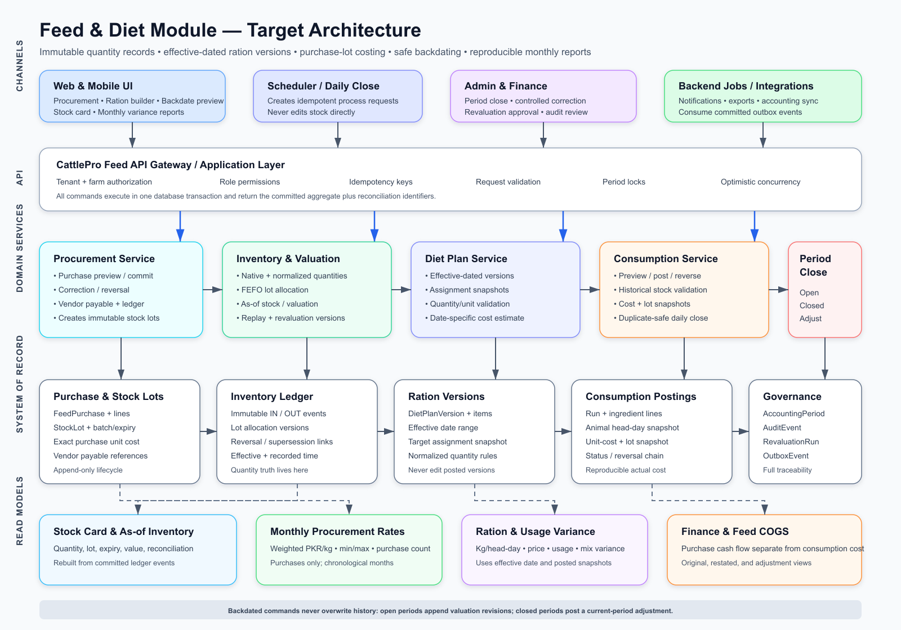

# Feed, Ration, Diet Plan, Inventory Valuation, and Reporting Re-architecture

**Audience:** Backend, frontend, database, QA, DevOps, and product teams  
**Status:** Implementation specification  
**Priority:** P0 data-integrity programme  
**Scope:** CattlePro web, mobile, backend APIs, scheduled jobs, migrations, and business reports  
**Last updated:** 2026-08-14

## 1. Executive Summary

The existing feed and diet module cannot reliably reproduce historical costs. A feed item's mutable `unitCost` is overwritten when a new purchase is recorded, while diet estimates and backdated consumption use that current value. Consequently, entering a late purchase or processing an old ration can alter the apparent economics of earlier months.

The target design makes the backend the sole transaction authority and separates five concerns:

1. **Ration quantity:** what should be fed, defined in an effective-dated diet-plan version.
2. **Physical stock:** what entered or left inventory, stored as immutable movements and purchase lots.
3. **Valuation:** which purchase lots funded a consumption posting and at what snapshotted cost.
4. **Finance:** purchase cash/payables versus inventory consumption cost.
5. **Reporting:** reproducible, date-effective read models derived from committed records.

The required implementation is not a chart-only correction. It requires an atomic procurement workflow, versioned rations, purchase lots, append-only stock movements, safe backdate simulation, accounting-period locks, migrations, and new frontend workflows.

## 2. Target Architecture



The SVG source is maintained beside this document at `docs/feed-diet-module-architecture.svg`.

## 3. Current Failure Modes

### 3.1 Latest purchase price overwrites history

Current procurement code updates the inventory item's `unitCost` to the latest entered rate. That field is then used by diet previews and processing. It is suitable only as a convenience display such as “latest purchase rate”; it must not be used as a historical cost source.

### 3.2 Procurement is not one atomic command

The current frontend first creates an expense and then updates inventory. A network or validation failure between those calls can leave:

- an expense without stock;
- stock without a corresponding payable or expense;
- a missing inventory movement;
- a reversal that cannot reconstruct the original transaction.

The existing canonical procurement endpoint must replace this split workflow.

### 3.3 Backdated processing has no historical valuation context

The current diet-process request contains dates and plan identifiers but no:

- diet-plan version identifier;
- valuation method/version;
- purchase-lot allocation;
- cost-as-of timestamp;
- accounting-period rule;
- expected aggregate version.

The resulting total cost cannot be independently reproduced later.

### 3.4 Diet plans are mutable instead of effective-dated

Editing a diet plan can change the formula used to explain historical processing. A posted consumption run must always reference the exact version that was effective on its business date.

### 3.5 Units are unsafe

The current UI may assume a missing bag weight. No backend calculation should silently assume 40 kg or any other conversion. Each purchase must explicitly capture its native quantity and normalized weight.

### 3.6 Procurement analytics mixes transaction types

Filtering only by expense category `FEED` includes generated daily consumption expenses in procurement history. Purchase analytics must use canonical purchase references, not expense descriptions or broad categories.

### 3.7 Monthly prices are statistically misleading

The existing trend uses a simple average of transaction rates and can connect gaps between months. The correct monthly purchase rate is quantity-weighted:

```text
weighted average rate per kg = sum(purchase total cost) / sum(normalized purchased kg)
```

Months must be keyed and sorted by `YYYY-MM`, with missing periods left blank.

## 4. Non-negotiable Design Principles

1. **The backend is the only writer of inventory and financial side effects.**
2. **Posted business records are immutable.** Corrections use reversal, supersession, or adjustment.
3. **Effective time and recorded time are separate.**
4. **All quantity and currency calculations use fixed-precision decimals, never binary floating point.**
5. **Every command is tenant-scoped, farm-scoped, authorized, idempotent, and transactional.**
6. **Every stock mutation creates an inventory movement.**
7. **Every historical consumption record snapshots its ration version, quantities, animal population, lot allocation, and cost.**
8. **Closed periods are never silently restated.**
9. **Read models may be rebuilt from the immutable transaction ledger.**
10. **No migration deletes or overwrites existing source records.**

## 5. Required Terminology

| Term | Definition |
| --- | --- |
| Effective date | Business date on which purchase, consumption, reversal, or adjustment applies. |
| Recorded at | Immutable server timestamp when the record was committed. |
| Feed item | Master definition such as Jantar, Barseen, Chokar, or Wanda. |
| Purchase lot | Quantity acquired at a specific rate, vendor, batch, date, and expiry. |
| Native unit | Unit entered and physically counted, such as BAG, BUNDLE, KG, or TON. |
| Normalized quantity | Canonical quantity in kilograms for feed reporting and comparison. |
| Ration version | Immutable effective-dated formula containing ingredients and quantities. |
| Consumption run | One posted execution of a ration version for a date and target population. |
| Head-day | One animal fed for one day; the denominator for normalized usage and cost. |
| Valuation allocation | Link between an outbound consumption line and the purchase lots that supplied it. |
| Revaluation run | Append-only recalculation of affected open-period cost allocations. |
| Closed period adjustment | Current-period financial/valuation entry correcting a locked historical period. |

## 6. Target Data Model

Use database-native `DECIMAL`/`NUMERIC` values. Suggested precision is illustrative and must be confirmed against expected farm scale.

### 6.1 `feed_item`

Master data only. It must not represent a purchase lot.

| Field | Type | Rule |
| --- | --- | --- |
| `id` | UUID/string | Primary key |
| `tenant_id` | UUID/string | Required |
| `farm_id` | UUID/string | Required |
| `name` | string | Unique per active farm after normalization |
| `feed_type` | enum | GRASS, WANDA, TMR, OTHER |
| `stock_unit` | enum | KG, BAG, BUNDLE, TON |
| `default_weight_per_unit_kg` | decimal nullable | Convenience default only; every lot stores its actual conversion |
| `latest_purchase_rate` | decimal nullable | Display-only; prohibited in historical valuation |
| `reorder_level_native` | decimal | Non-negative |
| `status` | enum | ACTIVE, INACTIVE, ARCHIVED |
| `version` | integer | Optimistic locking |

### 6.2 `feed_purchase`

Purchase aggregate header.

| Field | Type | Rule |
| --- | --- | --- |
| `id` | UUID/string | Primary key |
| `tenant_id`, `farm_id` | UUID/string | Required scope |
| `vendor_id` | UUID/string | Required unless approved cash supplier |
| `effective_date` | date | Business date |
| `recorded_at` | instant | Server-generated, immutable |
| `invoice_number` | string nullable | Vendor reference |
| `payment_status` | enum | PAID, PARTIAL, PENDING |
| `currency` | string | Tenant currency, initially PKR |
| `status` | enum | POSTED, REVERSED, CORRECTED |
| `client_mutation_id` | string | Required; unique by tenant |
| `reversal_of_id` | UUID nullable | Correction chain |
| `created_by` | UUID/string | Required |

### 6.3 `feed_purchase_line`

| Field | Type | Rule |
| --- | --- | --- |
| `id` | UUID/string | Primary key |
| `purchase_id` | UUID/string | Required FK |
| `feed_item_id` | UUID/string | Required FK |
| `native_quantity` | decimal | Greater than zero |
| `native_unit` | enum | Required |
| `weight_per_native_unit_kg` | decimal nullable | Required for BAG/BUNDLE |
| `normalized_quantity_kg` | decimal | Derived and stored |
| `unit_price_native` | decimal | Price per native unit |
| `normalized_unit_price_per_kg` | decimal | Derived and stored |
| `line_total` | decimal | Authoritative financial amount |
| `batch_number` | string nullable | Recommended |
| `expiry_date` | date nullable | Required when expiry-managed |

Validation must enforce:

```text
line_total = native_quantity × unit_price_native
normalized_quantity_kg = native_quantity × weight_per_native_unit_kg
normalized_unit_price_per_kg = line_total ÷ normalized_quantity_kg
```

For KG purchases, weight per unit is exactly `1`. For TON purchases, canonical conversion is exactly `1000 kg`. No implicit BAG/BUNDLE conversion is permitted.

### 6.4 `feed_stock_lot`

Created from one purchase line or an approved opening-balance import.

| Field | Type | Rule |
| --- | --- | --- |
| `id` | UUID/string | Primary key |
| `purchase_line_id` | UUID nullable | Null only for approved opening balance |
| `feed_item_id` | UUID/string | Required |
| `effective_date` | date | Lot availability date |
| `expiry_date` | date nullable | Used by FEFO allocation |
| `original_quantity_kg` | decimal | Immutable |
| `remaining_quantity_kg` | decimal | Projection guarded by version |
| `unit_cost_per_kg` | decimal | Immutable actual cost |
| `status` | enum | OPEN, DEPLETED, REVERSED, EXPIRED |
| `version` | integer | Optimistic locking |

### 6.5 `inventory_movement`

Append-only quantity ledger.

Required fields:

- `id`, `tenant_id`, `farm_id`, `feed_item_id`;
- `movement_type`: PURCHASE, DIET_CONSUMPTION, ADJUSTMENT, REVERSAL, EXPIRY, WRITE_OFF, OPENING_BALANCE;
- `direction`: IN or OUT;
- `effective_date` and `recorded_at`;
- `native_quantity`, `native_unit`, `normalized_quantity_kg`;
- `total_cost_snapshot`;
- `reference_type`, `reference_id`;
- `reversal_of_movement_id` and `superseded_by_movement_id` when applicable;
- `created_by`, `reason_code`, `notes`;
- `client_mutation_id`;
- immutable `sequence_number` for deterministic ordering.

Never update or delete a posted movement. A reversal is a new movement of equal magnitude and opposite direction.

### 6.6 `inventory_movement_allocation`

Versioned valuation mapping for outbound movements.

| Field | Type | Rule |
| --- | --- | --- |
| `id` | UUID/string | Primary key |
| `movement_id` | UUID/string | Outbound movement |
| `stock_lot_id` | UUID/string | Source lot |
| `allocation_version` | integer | Starts at 1 |
| `quantity_kg` | decimal | Positive |
| `unit_cost_per_kg` | decimal | Snapshot |
| `allocated_cost` | decimal | Quantity × cost |
| `status` | enum | ACTIVE, SUPERSEDED |
| `revaluation_run_id` | UUID nullable | Set for recalculated allocations |
| `supersedes_allocation_id` | UUID nullable | Audit chain |

### 6.7 `diet_plan`

Stable identity and lifecycle only.

| Field | Type | Rule |
| --- | --- | --- |
| `id`, `tenant_id`, `farm_id` | UUID/string | Required |
| `name` | string | Required |
| `status` | enum | DRAFT, ACTIVE, ARCHIVED |
| `current_version_id` | UUID nullable | Convenience pointer |
| `version` | integer | Optimistic locking |

### 6.8 `diet_plan_version`

Immutable after activation or first posting.

Required fields:

- `id`, `diet_plan_id`, `version_number`;
- `effective_from`, `effective_to`;
- `distribution_mode`: PER_ANIMAL, TOTAL_DISTRIBUTED, PER_HUNDRED_KG_BW;
- target definition and immutable assignment rule;
- `status`: DRAFT, ACTIVE, SUPERSEDED, ARCHIVED;
- `created_by`, `created_at`, `approved_by`, `approved_at`;
- `notes`, `change_reason`.

Prevent overlapping active version ranges for the same plan.

### 6.9 `diet_plan_version_item`

| Field | Type | Rule |
| --- | --- | --- |
| `id` | UUID/string | Primary key |
| `diet_plan_version_id` | UUID/string | Required |
| `feed_item_id` | UUID/string | Required |
| `quantity` | decimal | Positive |
| `unit` | enum | Explicit |
| `normalized_quantity_kg` | decimal | Stored |
| `sort_order` | integer | Stable UI order |

Do not store a mutable inventory price as part of the ration formula. A price shown in the builder is a date-specific estimate returned by a preview endpoint.

### 6.10 `feed_consumption_run`

| Field | Type | Rule |
| --- | --- | --- |
| `id` | UUID/string | Primary key |
| `farm_id` | UUID/string | Required |
| `effective_date` | date | Required |
| `diet_plan_version_id` | UUID/string | Exact formula |
| `target_snapshot_json` | JSON | Resolved animals/groups at posting time |
| `total_animals_fed` | integer | Non-negative |
| `head_days` | decimal | Normally animal count for one day |
| `total_cost_snapshot` | decimal | Sum of active lines |
| `valuation_version` | integer | Starts at 1 |
| `status` | enum | POSTED, REVERSED, ADJUSTED |
| `client_mutation_id` | string | Required |
| `processed_by`, `processed_at` | identity/instant | Required |
| `reversal_of_id` | UUID nullable | Audit chain |

Required uniqueness:

```text
(tenant_id, farm_id, diet_plan_version_id, effective_date, logical_target_key, status=POSTED)
```

The exact implementation may use an idempotency table if partial unique indexes are unavailable.

### 6.11 `feed_consumption_line`

Required fields:

- `consumption_run_id`, `feed_item_id`;
- ration quantity snapshot and unit;
- normalized required quantity in kg;
- actual issued quantity in kg;
- total cost snapshot;
- valuation version;
- outbound inventory movement ID;
- shortage or substitution metadata;
- status and supersession references.

### 6.12 `accounting_period`

| Field | Type | Rule |
| --- | --- | --- |
| `tenant_id`, `farm_id`, `year_month` | composite key | Required |
| `status` | enum | OPEN, CLOSING, CLOSED, REOPENED |
| `closed_at`, `closed_by` | nullable | Required when closed |
| `reopened_at`, `reopened_by`, `reason` | nullable | Controlled permission |
| `version` | integer | Optimistic locking |

### 6.13 `revaluation_run`

Stores the impact and approval of open-period replay or closed-period adjustment:

- affected feed item IDs;
- earliest effective date;
- old and new valuation totals;
- affected movement and consumption IDs;
- status: PREVIEWED, POSTED, FAILED, REVERSED;
- actor, timestamps, reason, approval;
- closed-period adjustment reference when applicable.

### 6.14 `audit_event` and transactional outbox

Every command writes an audit event and, where integrations are needed, an outbox event in the same transaction. Audit records contain actor, tenant, farm, action, aggregate, before/after summary, reason, request ID, and timestamp.

## 7. Valuation Policy

### 7.1 Required default

Use **FEFO physical allocation with actual purchase-lot cost**:

1. Eligible lots must have `effective_date <= consumption effective_date`.
2. Exclude reversed, depleted, and unavailable lots.
3. Sort by expiry date ascending, null expiry last, then effective date, recorded time, and ID.
4. Allocate quantity until the issue is fully satisfied.
5. Snapshot each allocation and cost on the outbound movement.
6. Block posting when historical stock is insufficient unless the user first records an approved opening balance or stock adjustment.

This physically prioritizes expiring feed and preserves actual cost. If the business later selects weighted-average valuation, implement it as a tenant-level policy with an effective date; never mix methods silently.

### 7.2 Price displayed in ration builder

The ration builder must call a preview endpoint with `asOfDate`. The response must state:

- estimated cost;
- valuation method;
- lots/rates considered;
- ingredients without sufficient stock or price history;
- explicit “estimate only” status.

Changing a purchase price may change a future estimate. It must not change a posted historical consumption snapshot.

### 7.3 Open-period backdated insertion

A backdated purchase or adjustment may alter later FEFO allocations in an open period. Handle this through a deterministic revaluation run:

1. Lock the affected feed item and farm using a database advisory or row lock.
2. Find the earliest affected effective date.
3. Read all eligible lots and outbound movements in deterministic sequence.
4. Simulate allocations without changing active projections.
5. Return a preview containing quantity and value differences.
6. On approval, insert new allocation versions and mark old allocation versions `SUPERSEDED`.
7. Insert valuation-adjustment ledger entries for cost differences.
8. Update consumption run valuation versions and read models.
9. Retain every old allocation and total for audit.

Quantity movements themselves remain immutable.

### 7.4 Closed-period backdated insertion

Do not change closed-period active valuation. The command must:

1. preserve the effective business date on the source record;
2. identify the locked-period difference;
3. create a current-open-period adjustment with a reference to the historical source;
4. show both “originally posted” and “including adjustments” views;
5. require a correction reason and authorized role.

## 8. Transaction and Concurrency Rules

### 8.1 Atomicity

The following must commit or roll back together:

**Purchase:** purchase header + lines + lots + inventory IN movements + expense/payable + payment + financial ledger + audit + outbox.

**Consumption:** run + lines + target snapshot + inventory OUT movements + allocations + cost snapshot + optional accounting COGS entry + audit + outbox.

**Reversal:** reversal aggregate + opposite movements + released lot quantities + finance reversal + audit + outbox.

### 8.2 Idempotency

- Require `Idempotency-Key` header and `clientMutationId` body field for every mutation.
- Scope uniqueness by tenant and operation.
- Store request hash, response body, status, and expiry.
- Same key + same request returns the original response.
- Same key + different request returns `409 IDEMPOTENCY_CONFLICT`.

### 8.3 Optimistic locking

Commands that depend on current inventory or plan state must include `expectedVersion`. Return `409 VERSION_CONFLICT` with the current version when stale.

### 8.4 Deterministic ordering

For equal effective dates, process events by:

```text
effective_date, movement_priority, recorded_at, sequence_number, id
```

Document movement priority. Recommended order is opening balance, purchase/positive adjustment, consumption/write-off, reversal.

## 9. API Contract Changes

Use `/api` if that is the deployed gateway prefix. The route examples below omit hostnames and require tenant headers.

### 9.1 Common headers

```http
X-Tenant: <tenant-id>
X-Farm-Id: <farm-id>
Idempotency-Key: <uuid>
If-Match: <aggregate-version>
```

Common error body:

```json
{
  "code": "HISTORICAL_STOCK_SHORTAGE",
  "message": "Jantar is short by 42.5 kg on 2026-03-12.",
  "requestId": "req_...",
  "fieldErrors": [],
  "details": {
    "feedItemId": "...",
    "effectiveDate": "2026-03-12",
    "availableKg": "77.500",
    "requiredKg": "120.000"
  }
}
```

Use strings for decimal JSON fields or guarantee lossless decimal serialization consistently.

### 9.2 Feed item APIs

- `GET /api/operations/feed-items?farmId=&status=&feedType=`
- `POST /api/operations/feed-items`
- `GET /api/operations/feed-items/{id}`
- `PATCH /api/operations/feed-items/{id}` for master-data fields only
- `POST /api/operations/feed-items/{id}/archive`
- `GET /api/operations/feed-items/{id}/stock?asOfDate=`
- `GET /api/operations/feed-items/{id}/lots?asOfDate=&status=`
- `GET /api/operations/feed-items/{id}/stock-card?from=&to=&page=`

Do not expose a generic endpoint that directly replaces quantity.

### 9.3 Procurement APIs

- `POST /api/procurement/feed-purchases/preview`
- `POST /api/procurement/feed-purchases`
- `GET /api/procurement/feed-purchases?farmId=&from=&to=&vendorId=&feedItemId=&status=`
- `GET /api/procurement/feed-purchases/{id}`
- `POST /api/procurement/feed-purchases/{id}/corrections/preview`
- `POST /api/procurement/feed-purchases/{id}/corrections`
- `POST /api/procurement/feed-purchases/{id}/reverse`

Avoid destructive `PUT` semantics for posted purchases. A correction creates a reversal/superseding purchase chain.

Example preview request:

```json
{
  "farmId": "farm-1",
  "vendorId": "vendor-4",
  "effectiveDate": "2026-03-04",
  "invoiceNumber": "INV-245",
  "payment": { "status": "PENDING", "amountPaid": "0.00" },
  "lines": [
    {
      "feedItemId": "wanda-1",
      "nativeQuantity": "10",
      "nativeUnit": "BAG",
      "weightPerNativeUnitKg": "40",
      "unitPriceNative": "2700.00",
      "batchNumber": "W-0326",
      "expiryDate": "2026-09-30"
    }
  ],
  "clientMutationId": "..."
}
```

Preview response must include calculated normalized quantities/rates, affected period, duplicate warnings, projected stock, payable impact, and whether revaluation is required.

### 9.4 Inventory APIs

- `GET /api/operations/inventory-movements`
- `GET /api/operations/inventory-movements/{id}`
- `GET /api/operations/inventory-movements/{id}/audit`
- `POST /api/operations/inventory-adjustments/preview`
- `POST /api/operations/inventory-adjustments`
- `POST /api/operations/inventory-write-offs/preview`
- `POST /api/operations/inventory-write-offs`
- `GET /api/operations/inventory/valuation?farmId=&asOfDate=&view=ORIGINAL|RESTATED`
- `GET /api/operations/inventory/reconciliation?farmId=&asOfDate=`

### 9.5 Diet-plan APIs

- `GET /api/operations/diet-plans?farmId=&status=&effectiveOn=`
- `POST /api/operations/diet-plans`
- `GET /api/operations/diet-plans/{id}`
- `GET /api/operations/diet-plans/{id}/versions`
- `POST /api/operations/diet-plans/{id}/versions`
- `GET /api/operations/diet-plans/{id}/versions/{versionId}`
- `POST /api/operations/diet-plans/{id}/versions/{versionId}/validate`
- `POST /api/operations/diet-plans/{id}/versions/{versionId}/activate`
- `POST /api/operations/diet-plans/{id}/versions/{versionId}/archive`
- `POST /api/operations/diet-plans/{id}/cost-preview`

Example cost-preview request:

```json
{
  "versionId": "diet-version-7",
  "asOfDate": "2026-03-12",
  "animalIds": ["animal-1", "animal-2"]
}
```

### 9.6 Consumption and backdate APIs

- `POST /api/operations/feed-consumption/preview`
- `POST /api/operations/feed-consumption`
- `GET /api/operations/feed-consumption?farmId=&from=&to=&planId=&status=`
- `GET /api/operations/feed-consumption/{id}`
- `POST /api/operations/feed-consumption/{id}/reverse/preview`
- `POST /api/operations/feed-consumption/{id}/reverse`
- `POST /api/operations/feed-consumption/backdate/preview`
- `POST /api/operations/feed-consumption/backdate`

Backdate preview request:

```json
{
  "farmId": "farm-1",
  "fromDate": "2026-03-01",
  "toDate": "2026-03-07",
  "dietPlanVersionIds": ["version-12"],
  "targetMode": "PLAN_DEFAULT",
  "valuationView": "RESTATED",
  "clientMutationId": "..."
}
```

Backdate preview response must include:

- run-level status per date and plan version;
- exact target animal count per date;
- existing duplicate postings;
- required ingredient quantities;
- historical stock before and after;
- purchase lots and rates that would be allocated;
- shortages, expiry conflicts, and missing conversion data;
- affected open and closed months;
- old versus new cost by month;
- required adjustment amount;
- stable `previewToken` bound to the source versions.

The commit request submits `previewToken`. Reject it if inventory, period, diet, or purchase versions changed after preview.

### 9.7 Period close and revaluation APIs

- `GET /api/accounting-periods?farmId=&fromMonth=&toMonth=`
- `POST /api/accounting-periods/{yearMonth}/close/preview`
- `POST /api/accounting-periods/{yearMonth}/close`
- `POST /api/accounting-periods/{yearMonth}/reopen`
- `POST /api/inventory-revaluations/preview`
- `POST /api/inventory-revaluations`
- `GET /api/inventory-revaluations/{id}`

Period close must verify no negative stock, unresolved drafts, failed postings, unbalanced ledger entries, or valuation reconciliation differences.

### 9.8 Reporting APIs

- `GET /api/reports/feed/monthly-summary`
- `GET /api/reports/feed/item-price-trend`
- `GET /api/reports/feed/usage-variance`
- `GET /api/reports/feed/ration-cost`
- `GET /api/reports/feed/purchase-consumption-reconciliation`
- `GET /api/reports/feed/backdate-adjustments`

Shared filters:

```text
farmId, locationId, from, to, feedItemId, feedType,
dietPlanId, dietPlanVersionId, vendorId, view=ORIGINAL|RESTATED
```

## 10. Backend Service Logic

### 10.1 Purchase command

1. Authenticate and authorize tenant/farm.
2. Resolve idempotency key.
3. Validate period and effective date.
4. Validate vendor, items, units, conversions, price, and expiry.
5. Calculate decimals server-side.
6. Detect duplicates using vendor, invoice, item, date, quantity, and amount warning rules.
7. Lock affected item projections.
8. Create purchase aggregate and lines.
9. Create lots and IN movements.
10. Create expense/payable, payment, and balanced ledger entries.
11. If backdated, run or queue deterministic revaluation according to period status.
12. Write audit and outbox events.
13. Commit once and return all identifiers and updated projections.

### 10.2 Consumption preview

1. Resolve the diet version effective on each requested date.
2. Resolve eligible animals as of each date, not today's active-animal list.
3. Snapshot head count, weights, categories, and explicit overrides.
4. Convert every ration quantity to kg using validated rules.
5. Query stock lots available as of the effective date.
6. Simulate FEFO allocations.
7. Detect duplicates, shortages, expired lots, closed periods, and missing data.
8. Return a signed/hashed preview token with source versions and expiry.

### 10.3 Consumption commit

1. Validate preview token and idempotency key.
2. Recheck period and aggregate versions.
3. Lock affected lots in deterministic order.
4. Create run, lines, OUT movements, and allocation snapshots.
5. Update lot projections.
6. Create COGS/usage accounting entry if required by finance policy.
7. Write audit/outbox events.
8. Commit atomically.

### 10.4 Reversal

Reversal must never delete the original run. It creates an opposite quantity movement, releases or offsets allocations, reverses accounting impact, marks the aggregate reversed, records reason and actor, and preserves links in both directions.

### 10.5 Daily scheduler

- Use the farm's configured timezone.
- Create one command per plan version and effective date.
- Use a deterministic idempotency key.
- Skip already posted combinations safely.
- Publish success/failure status and actionable notifications.
- Never process a plan version outside its effective date range.

## 11. Frontend Implementation

### 11.1 Procurement form

- Replace separate expense and inventory calls with preview + atomic commit.
- Require effective date, vendor, item, native quantity, native unit, price, and conversion.
- For BAG/BUNDLE, require weight per unit or measured total weight; no silent default.
- Show both native rate and normalized PKR/kg.
- Show lot/batch and expiry.
- Warn on duplicate invoice/transaction patterns.
- Clearly distinguish effective date from “recorded now”.
- Show revaluation/closed-period impact before posting a backdated purchase.
- Disable double submission and reuse the same idempotency key on retry.

### 11.2 Feed inventory screen

- Display on-hand native quantity, normalized kg, and as-of date.
- Display latest rate separately from inventory valuation rate.
- Add stock-card drawer with movement, lot, reference, effective date, recorded time, and actor.
- Add lot view with expiry and remaining quantity.
- Replace direct quantity editing with an adjustment workflow requiring reason and preview.
- Display reconciliation and negative-stock errors prominently.

### 11.3 Diet-plan builder

- Treat a plan as a stable identity with multiple versions.
- Show version number, effective dates, status, and change reason.
- Editing an activated/used version creates a new draft version.
- Validate overlapping effective dates.
- Separate ration quantities from price estimates.
- Label cost as “Estimated as of [date] using [valuation method]”.
- Show missing stock/price/conversion without converting it to zero cost.
- Preview expected kg/head-day and total kg/day.
- Require explicit activation and permission.

### 11.4 Daily processing screen

- Use preview before post.
- Display exact ration version, date, animal count, head-days, ingredients, lots, and costs.
- Show duplicates as “Already posted” rather than a generic skip.
- Show shortages with the exact missing item and quantity.
- Show successful run IDs and links to the stock card.

### 11.5 Backdate wizard

Required steps:

1. **Configure:** date range, plan versions, animal-selection policy.
2. **Validate:** duplicates, plan validity, animal history, conversions, historical stock.
3. **Financial impact:** old/new monthly quantities and cost, open/closed periods, required adjustment.
4. **Confirm:** reason, permission, explicit acknowledgement.
5. **Results:** per-date result, transaction IDs, errors, adjustments, export.

The wizard must not present today's estimated plan cost as the historical cost.

### 11.6 Procurement analytics

- Source purchase data only from canonical purchase records.
- Do not include generated feed-consumption expenses.
- Default to one selected ingredient; optionally compare a small explicit selection.
- Sort months using an ISO month key.
- Calculate weighted average, minimum, maximum, latest, quantity, and purchase count.
- Do not connect months with no purchases.
- Display normalized units and allow native-unit details.
- Clearly label purchase price, not diet cost.

### 11.7 Feed and diet reports

Monthly report columns:

- month;
- purchase quantity kg;
- weighted average purchase rate per kg;
- min/max purchase rate;
- total purchase spend;
- consumed quantity kg;
- animal head-days;
- kg per head-day;
- actual consumption cost;
- cost per head-day;
- closing stock quantity and value;
- waste/write-off;
- price variance;
- usage variance;
- mix variance where configured;
- backdated adjustment count and amount;
- valuation quality/status.

Required formulas:

```text
purchase weighted rate = purchase cost / purchased kg
kg per head-day = consumed kg / animal head-days
cost per head-day = consumption cost / animal head-days
price variance = (actual rate - baseline rate) × actual quantity
usage variance = (actual quantity - standard ration quantity) × baseline rate
```

Baseline policy must be explicit: approved budget rate, previous-period weighted rate, or ration standard rate.

### 11.8 UX and accessibility

- Use descriptive status text, not color alone.
- Keep tables usable on mobile through focused summaries and detail drawers.
- Preserve filters in the URL where practical.
- Provide loading, empty, partial-data, stale-preview, and error states.
- Never render missing cost as zero.
- Include tooltips explaining effective date, recorded date, latest rate, actual cost, and adjustment.
- Require confirmation only for meaningful commits/reversals, not navigation.

## 12. Migration and Record-Preservation Plan

### Phase M0 — Freeze and evidence

- Take encrypted database backup and verify restore.
- Export counts/totals by tenant, farm, item, month, and transaction type.
- Record checksums for purchases, expenses, inventory, consumption logs, and ledgers.
- Disable destructive cleanup scripts.
- Establish a migration run ID and audit owner.

### Phase M1 — Add schema without changing behavior

- Create new tables and indexes.
- Add nullable reference fields to existing records.
- Add audit/outbox/idempotency infrastructure.
- Deploy read-only reconciliation endpoints.
- Do not rewrite existing records.

### Phase M2 — Backfill purchase lots

For each canonical purchase or identifiable feed expense:

1. preserve original ID and payload in migration metadata;
2. derive native quantity, unit, weight, normalized kg, amount, and rate;
3. create a purchase and lot marked `MIGRATED`;
4. create an IN movement using the original effective date and a migration recorded timestamp;
5. mark confidence `VERIFIED`, `DERIVED`, or `UNRESOLVED`;
6. never invent a 40 kg conversion for an unknown bag weight.

Unresolved rows remain visible in a migration exception queue.

### Phase M3 — Backfill consumption

- Preserve original consumption cost as `legacy_recorded_cost`.
- Create run/line records referencing the original IDs.
- Resolve the best diet version snapshot possible.
- Allocate lots only when historical quantity and conversion evidence is sufficient.
- Mark valuation quality: VERIFIED, RECONSTRUCTED, LEGACY_RECORDED, or INCOMPLETE.
- Do not replace the legacy cost automatically when evidence is insufficient.

### Phase M4 — Reconcile

For every item and farm, reconcile:

```text
opening + purchases + positive adjustments + reversals in
- consumption - write-offs - expiry - reversals out
= expected closing quantity
```

Also reconcile purchase spend, payables, inventory value, and consumption cost by month. All differences require an explicit resolution record.

### Phase M5 — Dual-read and controlled cutover

- Backend writes only through canonical commands.
- Keep legacy endpoints read-only or reject them with a migration error.
- Compare legacy and new report outputs behind a feature flag.
- Obtain product/finance approval per farm.
- Switch frontend to new APIs.
- Monitor idempotency conflicts, negative stock, reconciliation differences, and job failures.

### Phase M6 — Close historical periods

- Approve an opening balance and valuation date.
- Close verified historical months.
- Route later corrections through closed-period adjustment logic.
- Retain legacy records indefinitely according to retention policy.

### Rollback

Rollback disables new command routes and returns the UI to read-only mode. It must not delete new transactions already committed. Database rollback means restoring the verified backup only under an approved incident procedure.

## 13. Detailed Engineering Task Board

### P0 — Database and platform foundation

- [ ] Define decimal precision and rounding policy for quantity, unit price, and currency.
- [ ] Create purchase, lot, movement, allocation, ration-version, consumption, period, revaluation, audit, outbox, and idempotency tables.
- [ ] Add tenant/farm foreign keys and indexes.
- [ ] Add unique idempotency and consumption-posting constraints.
- [ ] Add optimistic-lock versions.
- [ ] Add immutable-record database protections where supported.
- [ ] Implement transactional outbox worker.
- [ ] Add structured domain-error contract.
- [ ] Add permission checks for POST, reverse, period close, reopen, adjustment, and migration.

### P0 — Procurement backend

- [ ] Implement purchase preview.
- [ ] Implement atomic purchase commit.
- [ ] Create purchase lots and inventory IN movements.
- [ ] Integrate vendor payable, payments, and financial ledger.
- [ ] Implement purchase detail/list filters.
- [ ] Implement correction preview and superseding correction.
- [ ] Implement reversal without deletion.
- [ ] Add duplicate detection and idempotency.
- [ ] Remove direct dependency on frontend-created feed expense.
- [ ] Publish complete OpenAPI examples and errors.

### P0 — Inventory and valuation backend

- [ ] Implement unit normalization service.
- [ ] Reject missing BAG/BUNDLE conversions.
- [ ] Implement FEFO allocator using deterministic locks/order.
- [ ] Implement as-of stock and valuation queries.
- [ ] Implement stock card and lot detail queries.
- [ ] Implement controlled adjustment and write-off commands.
- [ ] Implement negative historical-stock detection.
- [ ] Implement revaluation preview/commit with versioned allocations.
- [ ] Implement original versus restated valuation views.
- [ ] Add reconciliation service and close blockers.

### P0 — Diet and consumption backend

- [ ] Split diet identity from immutable versions.
- [ ] Implement effective-date overlap validation.
- [ ] Implement version activation/archive lifecycle.
- [ ] Resolve animal assignments as of the processing date.
- [ ] Implement date-specific ration cost preview.
- [ ] Implement consumption preview token.
- [ ] Implement atomic consumption posting.
- [ ] Implement duplicate-safe daily processing.
- [ ] Implement reversal and adjustment chains.
- [ ] Implement safe backdate preview and commit.
- [ ] Update scheduler to use deterministic idempotency keys.
- [ ] Ensure posted runs always reference exact plan versions.

### P0 — Migration

- [ ] Create backup/restore rehearsal.
- [ ] Build purchase classification and backfill job.
- [ ] Build conversion exception queue.
- [ ] Build consumption backfill job.
- [ ] Store legacy source IDs, payload hashes, cost, and confidence.
- [ ] Build item/month reconciliation report.
- [ ] Dry-run against a copied production database.
- [ ] Obtain farm-level sign-off before close/cutover.

### P1 — Frontend procurement and inventory

- [ ] Replace split writes with preview + commit.
- [ ] Add explicit unit and conversion entry.
- [ ] Add normalized-rate display.
- [ ] Add duplicate/backdate/closed-period impact preview.
- [ ] Add stock-card and lot UI.
- [ ] Replace direct quantity edits with adjustments.
- [ ] Add correction and reversal detail screens.
- [ ] Preserve idempotency keys across retry.

### P1 — Frontend diet and processing

- [ ] Add ration version timeline and status.
- [ ] Create new version when editing posted/active plans.
- [ ] Separate quantities from date-specific estimated cost.
- [ ] Add validation for effective dates and units.
- [ ] Replace current process action with preview + post.
- [ ] Rebuild backdate workflow as five-step wizard.
- [ ] Link results to stock card, run, and adjustment details.
- [ ] Add stale-preview and version-conflict handling.

### P1 — Reports and charts

- [ ] Create canonical backend monthly summary.
- [ ] Create item price trend using weighted rates.
- [ ] Create usage, price, and mix variance queries.
- [ ] Create purchase/consumption/stock reconciliation report.
- [ ] Filter procurement history to canonical purchases only.
- [ ] Sort periods by ISO keys and leave gaps unconnected.
- [ ] Add original/restated/adjustment view controls.
- [ ] Add CSV export using the same server result.
- [ ] Remove client-side recomputation of authoritative totals.

### P1 — Period governance and audit

- [ ] Implement close preview and close command.
- [ ] Implement privileged reopen with reason.
- [ ] Block backdated mutation of closed periods.
- [ ] Create current-period adjustment flow.
- [ ] Add audit-log UI and API filters.
- [ ] Notify finance/admin of revaluations and close failures.

### P2 — Operations and observability

- [ ] Add metrics for failed commands, retries, idempotency conflicts, negative stock, and reconciliation differences.
- [ ] Add trace IDs across API, database, scheduler, and outbox.
- [ ] Add dead-letter handling for outbox consumers.
- [ ] Add dashboards and alerts for scheduled feed processing.
- [ ] Document manual recovery runbooks.
- [ ] Add performance tests for farms with multi-year daily postings.

## 14. Test Strategy

### Unit tests

- Every unit conversion.
- FEFO ordering, partial-lot allocation, and rounding.
- Ration modes and animal/weight snapshots.
- Weighted monthly price and variance formulas.
- Period status rules.
- Idempotency and version-conflict behavior.

### Property-based tests

- Inventory quantity never changes without balancing movements.
- Sum of lot allocations equals outbound movement quantity.
- Sum of active allocations equals movement cost.
- Reversal plus original produces zero net quantity and cost impact.
- Reprocessing identical command does not create new records.
- Read-model rebuild equals the existing projection.

### Integration tests

- Purchase commits stock, payable, ledger, movement, lot, audit, and outbox together.
- Forced failure at every transaction step rolls back everything.
- Two concurrent consumptions cannot allocate the same lot quantity.
- Backdated purchase preview becomes stale after another stock command.
- Closed period generates adjustment rather than restatement.
- Purchase reversal restores all dependent balances.

### Migration tests

- Source row counts and hashes remain unchanged.
- Every migrated record references its source.
- Unresolved conversions do not receive invented values.
- Quantity and value reconciliation is produced per item/month.
- Migration rerun is idempotent.

### End-to-end tests

1. Purchase Wanda in bags at one price.
2. Purchase another batch at a different price.
3. Activate a ration version.
4. Post daily consumption.
5. Verify FEFO lot allocation and cost snapshot.
6. Enter a backdated purchase in an open month and preview revaluation.
7. Verify old allocation remains auditable after supersession.
8. Close the month.
9. Enter another historical correction and verify current-period adjustment.
10. Confirm monthly reports remain reproducible after reload and rebuild.

## 15. Acceptance Criteria

The re-architecture is complete only when:

- a later purchase cannot silently change a posted historical consumption cost;
- every purchase and consumption is atomic and idempotent;
- every stock change has an immutable movement and actor;
- every ration posting references an immutable diet version;
- every consumption cost can be traced to purchase lots or an explicit legacy valuation;
- backdating always provides an impact preview;
- insufficient historical stock is blocked with an actionable error;
- closed months remain locked and corrections become adjustments;
- procurement charts contain purchases only and use weighted normalized rates;
- report totals are calculated by canonical backend queries;
- migration preserves every legacy source record and provides reconciliation evidence;
- web and mobile use the same APIs and business rules;
- OpenAPI, database migration notes, runbooks, and regression tests are delivered.

## 16. Recommended Delivery Sequence

1. Database, audit, idempotency, decimals, and domain errors.
2. Atomic procurement and purchase lots.
3. Immutable inventory ledger and FEFO valuation.
4. Diet-plan versioning.
5. Consumption preview/post/reverse.
6. Backdate and revaluation workflows.
7. Period close and adjustments.
8. Migration, reconciliation, and production cutover.
9. Frontend procurement/inventory redesign.
10. Frontend ration/backdate redesign.
11. Canonical reports and chart replacement.
12. Mobile integration, performance, monitoring, and operational handoff.

Do not begin by rewriting charts. Charts must be the last consumer of the canonical backend read models.

## 17. Definition of Done for Each Backend Pull Request

- Database migration included and reversible where structurally possible.
- Tenant/farm authorization tests included.
- Idempotency and concurrency tests included.
- Audit and outbox behavior verified.
- OpenAPI schema, examples, and error responses updated.
- No direct overwrite/delete of posted records.
- Decimal and timezone behavior documented.
- Relevant reconciliation query included.
- Frontend contract reviewed.
- Production rollout and rollback notes included.
